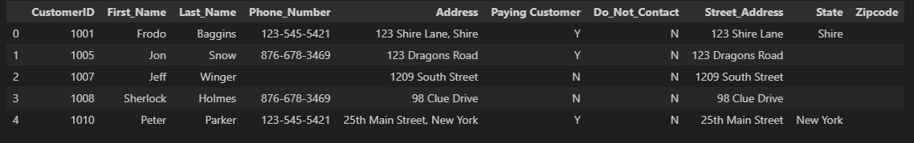

# 🧹 Data Cleaning in Pandas

---

## 📝 Summary

This project demonstrates basic **data cleaning techniques** using the Pandas library in Python. The process was completed in a Jupyter Notebook and includes steps like checking for missing values, handling duplicates, renaming columns, and correcting data types. The goal was to turn messy or inconsistent data into a clean and usable dataset for analysis.

---

## 🔧 What I Did

- Loaded a dataset into a Pandas DataFrame
- Explored the structure and identified issues (e.g. null values, inconsistent column names)
- Dropped or filled missing data using `.dropna()` and `.fillna()`
- Removed duplicate entries with `.drop_duplicates()`
- Renamed columns for consistency and clarity
- Converted columns to the correct data types

---

## 📚 What I Learned

- How to inspect and explore a dataset using `.info()`, `.head()`, and `.describe()`
- How to identify and handle missing or duplicate data
- How to rename columns and convert data types in Pandas
- The importance of clean data for accurate analysis

---

## ✅ Result

At the end of the notebook, the dataset was cleaned and ready for further analysis or visualization. The steps taken demonstrate a foundational workflow in data preprocessing.

---

## 🌄 Screenshots

### 🔍 Before Cleaning

### 🧼 After Cleaning

---

## 🌱 Future Improvements

- Automate data cleaning using functions
- Add visualizations to understand data distributions
- Apply the same cleaning process to a larger or messier real-world dataset
- Explore use of `sklearn` or `numpy` alongside Pandas for additional preprocessing
